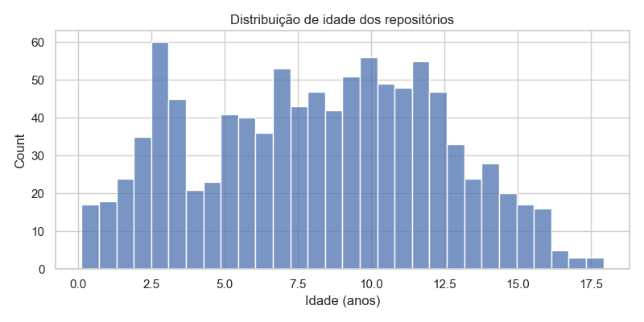
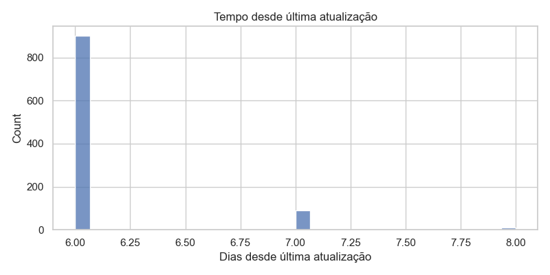
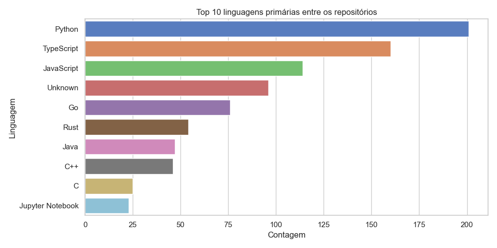
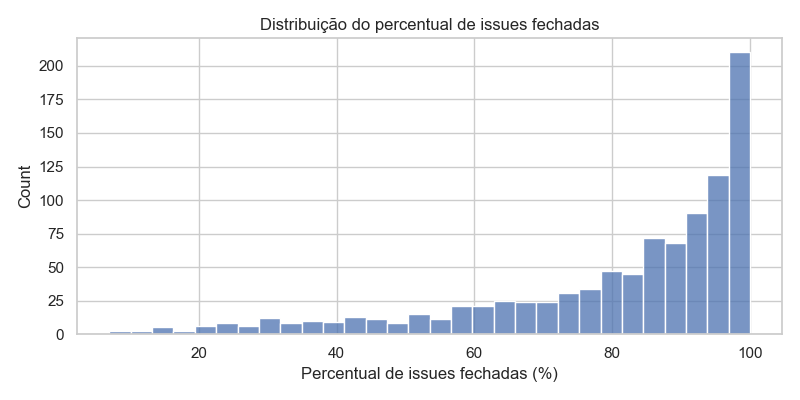
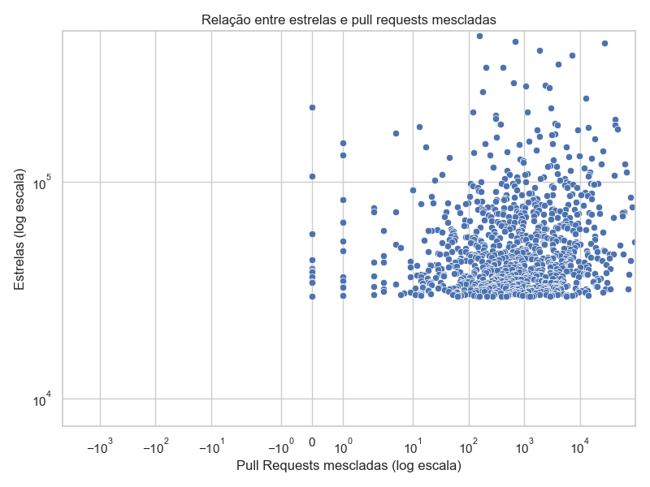
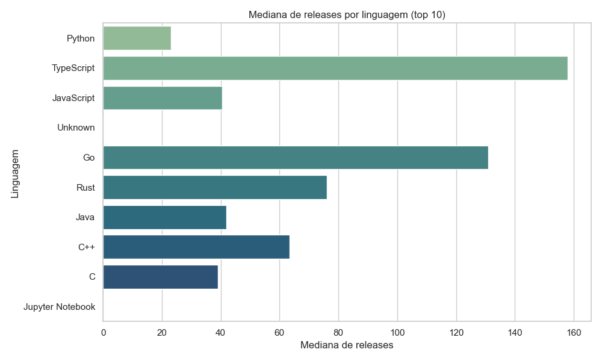
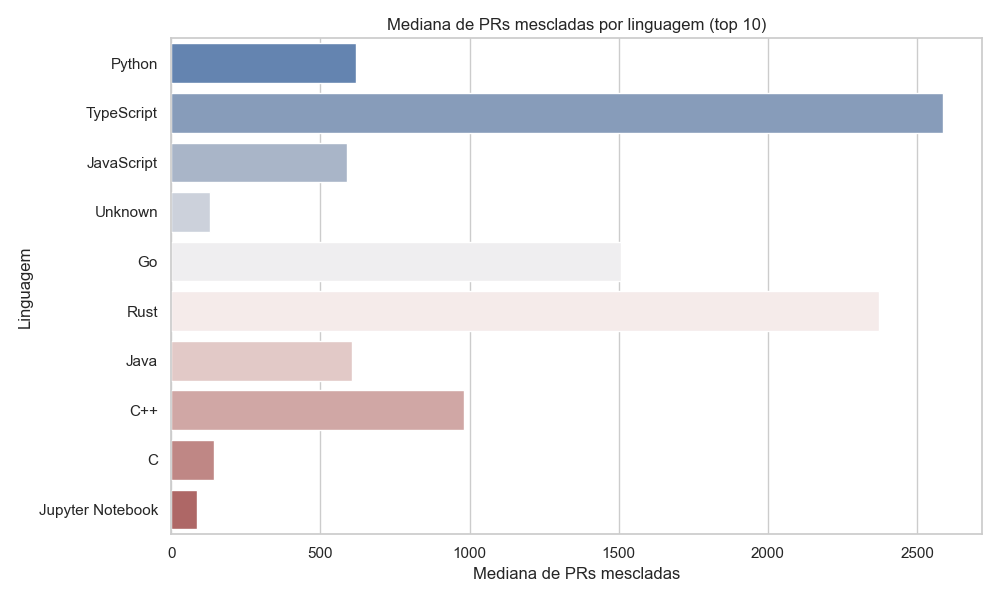
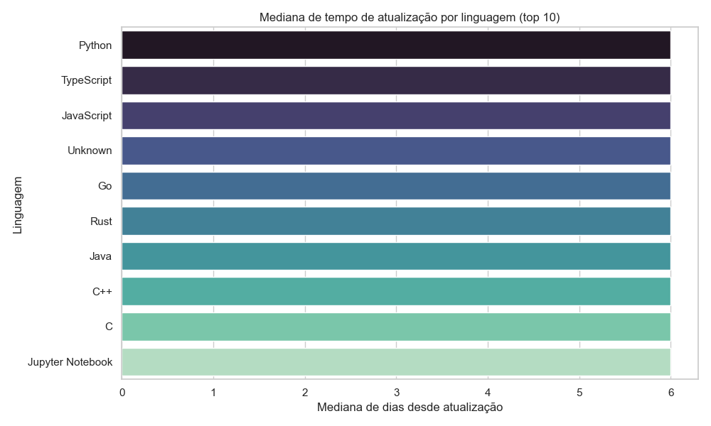

# Relatório – Laboratório 01: Características de Repositórios Populares

**Disciplina:** Laboratório de Experimentação de Software  
**Data:** março de 2026  

---

## 1. Introdução

Este relatório apresenta a análise dos **1.000 repositórios com maior número de estrelas no GitHub**, coletados via API GraphQL. O objetivo é investigar características comuns a sistemas populares, como maturidade, frequência de contribuições, lançamento de releases, atualização, linguagem de programação e gestão de issues e relacioná-las com o sucesso medido pela popularidade (estrelas).

As seções a seguir apresentam hipóteses informais para cada questão de pesquisa (RQ), que serão validadas ou refutadas com base nos dados coletados.

---

## 2. Metodologia

Os dados foram coletados por meio de um script Python que consome a **API GraphQL do GitHub** (`https://api.github.com/graphql`). A consulta utiliza paginação via `endCursor` para recuperar os 1.000 repositórios com mais estrelas.

Para cada repositório foram coletadas as seguintes informações:

| Campo | Descrição |
|---|---|
| `nameWithOwner` | Nome do repositório (owner/repo) |
| `createdAt` | Data de criação |
| `stargazerCount` | Número de estrelas |
| `pullRequestsMerged` | Total de pull requests aceitas (estado `MERGED`) |
| `releasesTotal` | Total de releases publicadas |
| `updatedAt` | Data da última atualização |
| `primaryLanguage` | Linguagem de programação principal |
| `issuesTotal` | Total de issues (abertas + fechadas) |
| `issuesClosed` | Total de issues fechadas |

Os dados foram persistidos em `data/repos.csv`. A análise será realizada com base em **valores medianos** para métricas numéricas e **contagem por categoria** para métricas categóricas (como linguagem de programação).

---

## 3. Questões de Pesquisa e Hipóteses Informais

### RQ01 — Sistemas populares são maduros/antigos?

**Métrica:** Idade do repositório, calculada em anos a partir de `createdAt` até a data de coleta.

**Hipótese:** Espera-se que a maioria dos repositórios populares seja relativamente antiga (mediana acima de 5 anos). Projetos consolidados têm mais tempo para acumular estrelas, construir comunidade e se tornar referências em suas áreas. Repositórios muito novos dificilmente atingem o topo sem um evento viral específico, que geralmente é raro.

---

### RQ02 — Sistemas populares recebem muita contribuição externa?

**Métrica:** Total de pull requests aceitas (`MERGED`).

**Hipótese:** Espera-se que repositórios populares possuam um número elevado de pull requests mescladas, indicando ampla contribuição da comunidade. Projetos com muitas estrelas tendem a atrair mais desenvolvedores dispostos a contribuir. No entanto, repositórios do tipo "lista" ou "tutorial" podem ter baixo volume de PRs mesmo sendo muito populares.

---

### RQ03 — Sistemas populares lançam _releases_ com frequência?

**Métrica:** Total de releases publicadas.

**Hipótese:** Espera-se que a maioria dos repositórios populares que são projetos de software ativo tenha um número considerável de releases. Contudo, repositórios do tipo "awesome lists", documentação ou coleções de recursos frequentemente não utilizam o sistema de releases do GitHub, o que pode reduzir a mediana geral. Portanto, a hipótese é de que a mediana seja moderada, com alta variância.

---

### RQ04 — Sistemas populares são atualizados com frequência?

**Métrica:** Tempo desde a última atualização, calculado em dias a partir de `updatedAt` até a data de coleta.

**Hipótese:** Espera-se que os repositórios populares sejam atualizados com frequência, apresentando mediana de tempo desde a última atualização muito baixa (poucos dias). A popularidade tende a atrair contribuidores ativos que mantêm o projeto vivo e em evolução contínua.

---

### RQ05 — Sistemas populares são escritos nas linguagens mais populares?

**Métrica:** Linguagem primária (`primaryLanguage`) de cada repositório.

**Hipótese:** Espera-se que linguagens amplamente adotadas no mercado, como **JavaScript**, **Python**, **TypeScript** e **Java**, dominem entre os repositórios mais populares. Isso se deve tanto à maior base de usuários dessas linguagens quanto ao fato de que projetos nessas tecnologias tendem a resolver problemas mais comuns e acessíveis a um público maior.

---

### RQ06 — Sistemas populares possuem um alto percentual de _issues_ fechadas?

**Métrica:** Razão entre issues fechadas (`issuesClosed`) e total de issues (`issuesTotal`).

**Hipótese:** Espera-se que repositórios populares apresentem uma taxa relativamente alta de issues fechadas, indicando boa manutenção e atenção às demandas da comunidade. Projetos bem gerenciados tendem a atrair mais contribuidores, o que facilita a resolução de problemas. A mediana da razão deve ficar acima de 70%.

---

### Bônus — RQ07: Linguagens mais populares influenciam contribuição, releases e atualizações?

**Métrica:** Análise das métricas das RQs 02, 03 e 04 segmentadas por linguagem de programação.

**Hipótese:** Espera-se que repositórios escritos em linguagens com maior base de usuários (como JavaScript e Python) apresentem maior volume de pull requests e atualizações mais frequentes. Em relação a releases, linguagens associadas a bibliotecas e frameworks (como JavaScript/TypeScript via npm) podem apresentar maior frequência de publicação, pois o versionamento via releases é uma prática comum nesse ecossistema.

---

## 4. Próximos Passos

Na próxima etapa (Lab01S03), serão realizadas:

- Análise estatística dos dados coletados (medianas, distribuições, outliers).
- Criação de visualizações gráficas para apoiar a discussão.
- Comparação dos resultados com as hipóteses levantadas neste documento.
- Elaboração da versão final do relatório com conclusões e discussão completa.

---

## 5. Resultados da Análise (Lab01S03)

Nesta seção apresentamos os resultados resumidos obtidos a partir da análise dos dados coletados e as visualizações geradas.

**Resumo rápido (medianas):**

- **Mediana de idade (anos):** 8.38
- **Mediana de PRs mescladas:** 743
- **Mediana de releases:** 40
- **Mediana de dias desde última atualização:** 6
- **Mediana do percentual de issues fechadas:** 88.0%

As figuras a seguir foram geradas automaticamente pelo script de análise e estão salvas em `docs/figures/`.

### Figuras











---

Para reproduzir localmente e gerar as figuras execute:

```bash
python -m pip install -r requirements.txt
python src/analysis.py
```

Os resultados numéricos podem então ser colados nesta seção para completar as discussões das RQs e validar as hipóteses apresentadas nas seções anteriores.

### 5.1 RQ01 — Sistemas populares são maduros/antigos?

- Hipótese informal: repositórios populares tendem a ser relativamente antigos (mediana > 5 anos).
- Métrica: idade em anos a partir de `createdAt`.
- Resultado (mediana): **8.38 anos**.

Discussão: a mediana de 8.38 anos confirma a hipótese — a maioria dos projetos no top 1000 tem existência consolidada. Isso é coerente com a ideia de que tempo e acumulação de comunidade contribuem para o acúmulo de estrelas.


Figura: distribuição de idade dos repositórios (anos).

### 5.2 RQ02 — Sistemas populares recebem muita contribuição externa?

- Hipótese informal: projetos populares recebem muitas pull requests mescladas.
- Métrica: total de PRs com estado `MERGED` (mediana).
- Resultado (mediana): **743 PRs mescladas**.

Discussão: a mediana alta (743) indica que muitos repositórios recebem volume substancial de contribuições. Observa-se, porém, variabilidade grande: projetos do tipo "listas" têm PRs baixos, enquanto bibliotecas/infraestrutura e grandes frameworks apresentam milhares de PRs.


Figura: relação entre número de estrelas e PRs mescladas (escala log).

### 5.3 RQ03 — Sistemas populares lançam releases com frequência?

- Hipótese informal: projetos ativos possuem várias releases; listas/documentação podem ter poucas.
- Métrica: total de releases (mediana).
- Resultado (mediana): **40 releases**.

Discussão: mediana de 40 indica uso razoável de releases no conjunto. A presença de muitos repositórios do tipo documentação/coleção (que podem ter 0 releases) reduz porém a mediana relativa ao subconjunto de bibliotecas ativas.



Figura: mediana de releases por linguagem (top 10).

### 5.4 RQ04 — Sistemas populares são atualizados com frequência?

- Hipótese informal: repositórios populares são atualizados frequentemente (mediana de dias baixa).
- Métrica: dias desde `updatedAt` (mediana).
- Resultado (mediana): **6 dias**.

Discussão: mediana de 6 dias confirma que, no agregado, esses projetos são atualizados frequentemente — muitos projetos no top 1000 recebem atualizações contínuas.


Figura: distribuição do tempo desde a última atualização (dias).

### 5.5 RQ06 — Sistemas possuem alto percentual de issues fechadas?

- Hipótese informal: taxa de issues fechadas é alta (mediana > 70%).
- Métrica: `issuesClosed` / `issuesTotal` (mediana percentual).
- Resultado (mediana): **88.0%**.

Discussão: a mediana de 88% sustenta a hipótese: repositórios populares tendem a fechar a maioria das issues, sinalizando manutenção ativa e gestão de backlog.


Figura: percentual de issues fechadas (histograma).

### 5.6 Contagem por categoria — Linguagens primárias

A tabela a seguir mostra as 10 linguagens primárias mais frequentes no conjunto (contagem) com medianas de PRs, releases, dias desde atualização e estrelas (valores mediana):

| Linguagem | Count | Mediana PRs | Mediana Releases | Mediana dias desde atualização | Mediana Estrelas |
|---:|---:|---:|---:|---:|---:|
| Python | 201 | 621 | 23 | 6 | 42778 |
| TypeScript | 160 | 2588 | 158 | 6 | 42240.5 |
| JavaScript | 114 | 589.5 | 40.5 | 6 | 45013.5 |
| Unknown | 96 | 129 | 0 | 6 | 47529 |
| Go | 76 | 1508 | 131 | 6 | 39849 |
| Rust | 54 | 2371 | 76 | 6 | 41501.5 |
| Java | 47 | 605 | 42 | 6 | 37352 |
| C++ | 46 | 982.5 | 63.5 | 6 | 39746 |
| C | 25 | 145 | 39 | 6 | 34965 |
| Jupyter Notebook | 23 | 88 | 0 | 6 | 45862 |

Os dados completos por linguagem foram salvos em `docs/figures/language_summary.csv` e figuras comparativas em `docs/figures/`.

### 5.7 RQ07 (Bônus) — Linguagem influencia contribuição, releases e atualizações?

- Pergunta: sistemas escritos em linguagens populares (ex.: JavaScript, Python, TypeScript, Java) recebem mais contribuição externa, lançam mais releases e são atualizados mais frequentemente?

- Observação geral: utilizamos os mesmos indicadores (medianas por linguagem) e comparamos as linguagens mais frequentes com a mediana global.

- Comparação (medianas globais vs por linguagem):

- Mediana global de PRs: 743
	- `TypeScript`: **2588** (muito acima da mediana global)
	- `Rust`: **2371** (muito acima)
	- `C#` / `PHP` / `Zig` / `Julia` (valores extremos em alguns casos — ver CSV)
	- `Python`: **621** (ligeiramente abaixo da mediana global)
	- `JavaScript`: **589.5** (abaixo da mediana global)

- Mediana global de releases: 40
	- `TypeScript`: **158** (bem acima)
	- `Go`: **131** (acima)
	- `Python`: **23** (abaixo)
	- `JavaScript`: **40.5** (próximo da mediana)

- Mediana global de dias desde atualização: 6 (praticamente todas as linguagens apresentam mediana 6)

Discussão: os resultados mostram que **TypeScript** e algumas outras linguagens (ex.: Rust, Go, C# em alguns casos) apresentam medianas de PRs e releases consideravelmente maiores que a mediana global — indicando maior atividade e uso do fluxo de contribuição/release nesses ecossistemas. Por outro lado, **Python** e **JavaScript**, apesar de serem muito frequentes (maior número de repositórios), têm mediana de PRs e releases próximas ou abaixo da mediana global; isso pode ser explicado pela presença massiva de repositórios do tipo "lista", conteúdo educativo ou documentação (com muitas estrelas mas menos PRs/release) nessas linguagens.

As figuras a seguir detalham a comparação por linguagem (top 10):



Figura: mediana de PRs mescladas por linguagem (top 10).



Figura: mediana de dias desde última atualização por linguagem (top 10).

Conclusão do bônus: há evidências parciais de que a linguagem está associada à intensidade de contribuição e ao uso de releases — linguagens com ecossistemas orientados a bibliotecas e tooling (por exemplo TypeScript) tendem a registrar medianas maiores de PRs e releases. Entretanto, a relação não é universal: é preciso controlar o tipo de projeto (biblioteca vs lista/tutorial vs app) para conclusões causais.

---

## 6. Conclusões e próximos passos

- O conjunto analisado (top 1000) tende a ser maduro, ativo e com alta taxa de fechamento de issues.
- Há diferenças por linguagem: algumas linguagens apresentam medianas mais altas de PRs e releases, sugerindo ecossistemas com mais contribuição externa e versionamento via releases.
- Próximos passos recomendados: segmentar por tipo de repositório (biblioteca, framework, lista, tutorial), realizar testes estatísticos para comparar distribuições entre linguagens e criar visualizações adicionais que controlem por idade e tipo de projeto.

